# springboot-blog

## Spring Boot Blog Demo
## About
This is a demo project for practicing **Spring Boot + Thymeleaf.** The idea was to build some basic blogging platform.

It was made using **Spring Boot, Spring Security, Thymeleaf, Spring Data JPA, Spring Data REST and Docker.** Database is in memory **H2.**

There is a login and registration functionality included.

User has his own blog page, where he can add new blog posts. Every authenticated user can comment on posts made by other users. Home page is paginated list of all posts. Non-authenticated users can see all blog posts, but cannot add new posts or comment.

## Configuration
### Configuration Files
Folder **src/resources/** contains config files for **blog-demo** Spring Boot application.

**src/resources/application.properties** - main configuration file. Here it is possible to change admin username/password, as well as change the port number.

## How to run
There are several ways to run the application. You can run it from the command line with included Maven Wrapper, Maven or Docker.

Once the app starts, go to the web browser and visit http://localhost:8080/home

Admin username: naruto

Admin password: password

User username: sasuke

User password: password

## Maven Wrapper
**Using the Maven Plugin**

Go to the root folder of the application and type:
```
$ chmod +x mvnw
$ mvnw clean spring-boot:run
```
**Using Executable Jar**

Or you can build the JAR file with
```
$ mvnw clean package
```
Then you can run the JAR file:
```
$ java -jar target/springboot-blog-0.0.1-SNAPSHOT.jar
```
## Maven
Open a terminal and run the following commands to ensure that you have valid versions of Java and Maven installed:
```
$ java -version
openjdk version "1.8.0_202"
OpenJDK Runtime Environment (build 1.8.0_202-20190206132754.buildslave.jdk8u-src-tar--b08)
OpenJDK GraalVM CE 1.0.0-rc14 (build 25.202-b08-jvmci-0.56, mixed mode)
```
```
$ mvn -v
Apache Maven 3.6.0 (97c98ec64a1fdfee7767ce5ffb20918da4f719f3; 2018-10-25T01:41:47+07:00)
Maven home: /usr/local/Cellar/maven/3.6.0/libexec
Java version: 12, vendor: Azul Systems, Inc., runtime: /Users/hendisantika/.sdkman/candidates/java/12.0.0-zulu
Default locale: en_ID, platform encoding: UTF-8
OS name: "mac os x", version: "10.14.4", arch: "x86_64", family: "mac"
```
**Using the Maven Plugin**
The Spring Boot Maven plugin includes a run goal that can be used to quickly compile and run your application. Applications run in an exploded form, as they do in your IDE. The following example shows a typical Maven command to run a Spring Boot application:
```
$ mvn clean spring-boot:run
```
**Using Executable Jar**
To create an executable jar run:
```
$ mvn clean package
```
To run that application, use the java -jar command, as follows:
```
$ java -jar target/springboot-blog-0.0.1-SNAPSHOT.jar
```
To exit the application, press **ctrl-c**.

**Docker**
It is possible to run blog-demo using Docker:

Build Docker image:
```
$ mvn clean package
$ docker build -t blog-demo:dev .
```
Run Docker container:
```
$ docker run --rm -i -p 8080:8080 --name blog-demo springboot-blog-demo:dev
```
Helper script
It is possible to run all of the above with helper script:
```
$ chmod +x run_docker.sh
$ run_docker.sh
```
## Docker
Folder docker contains:

**Dockerfile** - Docker build file for executing blog-demo Docker image. Instructions to build artifacts, copy build artifacts to docker image and then run app on proper port with proper configuration file.
## Util Scripts
run_docker.sh.sh - util script for running blog-demo Docker container using docker/Dockerfile
## Tests
Tests can be run by executing following command from the root of the project:
```
$ mvn test
```

## Helper Tools
**HAL REST Browser**
Go to the web browser and visit http://localhost:8080/

You will need to be authenticated to be able to see this page.

H2 Database web interface
Go to the web browser and visit http://localhost:8080/h2-console

In field **JDBC URL** put
```
jdbc:h2:mem:blog_simple_db
```
In `/src/main/resources/application.properties` file it is possible to change both web interface url path, as well as the datasource url.

**H2 Login**

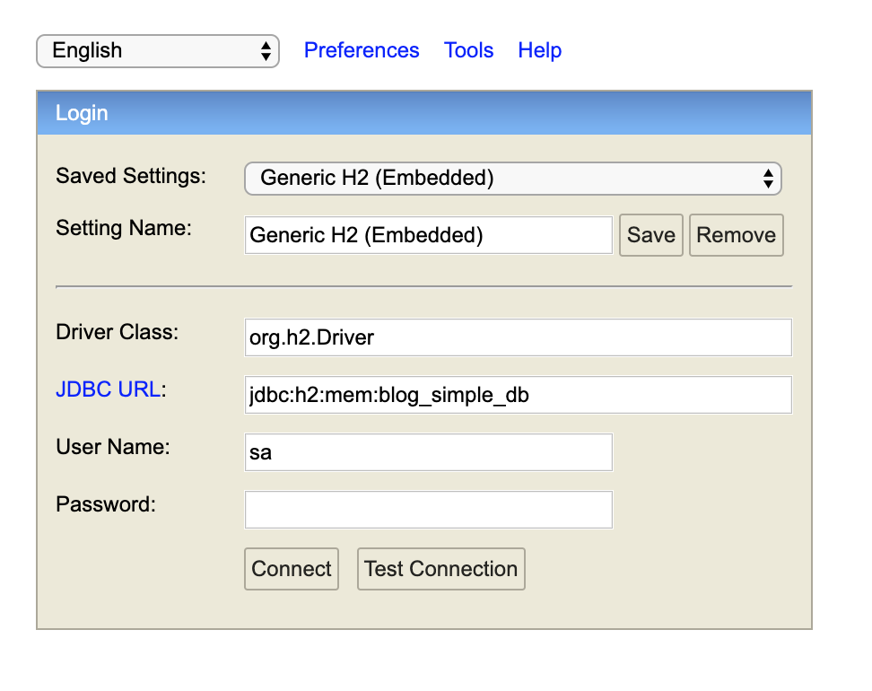

**H2 Home**

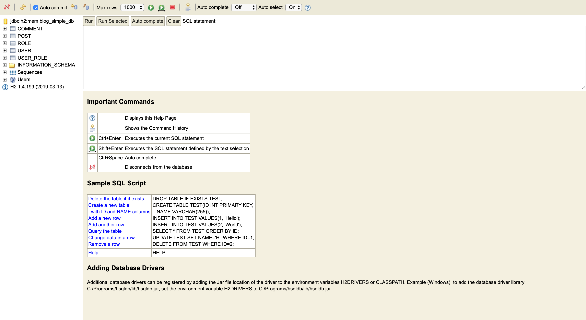

**H2 Comments Data**

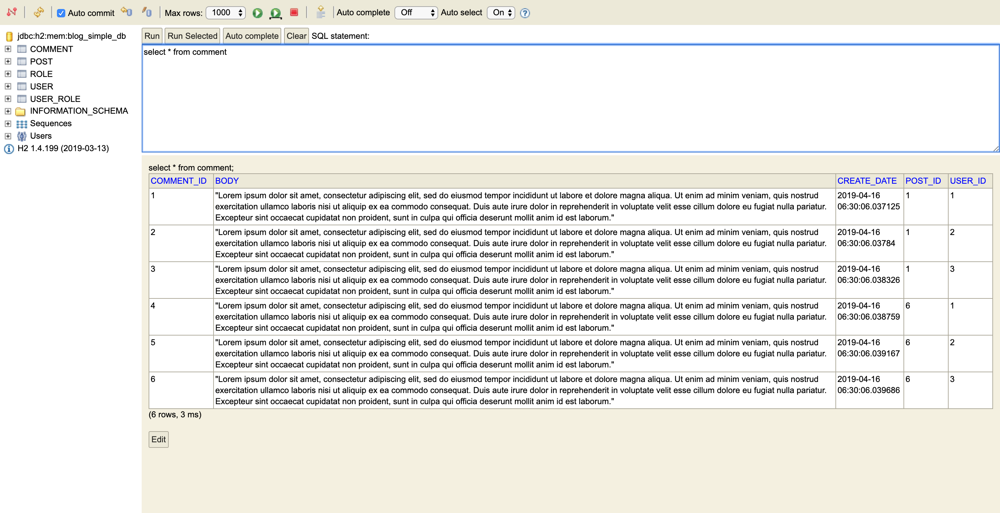

**H2 Posts Data**

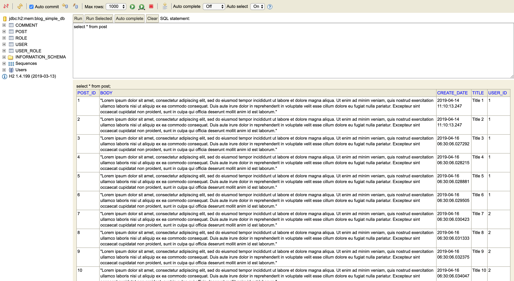


## Screen shot

**Login Page**

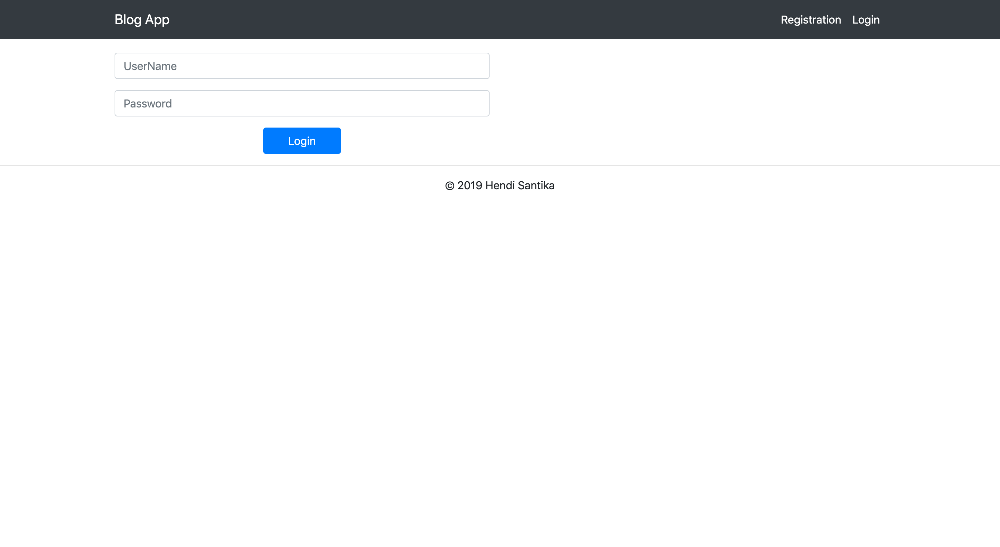

**Registration Page**

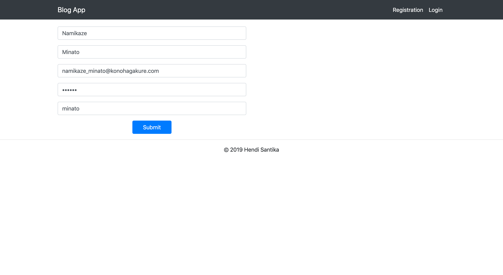

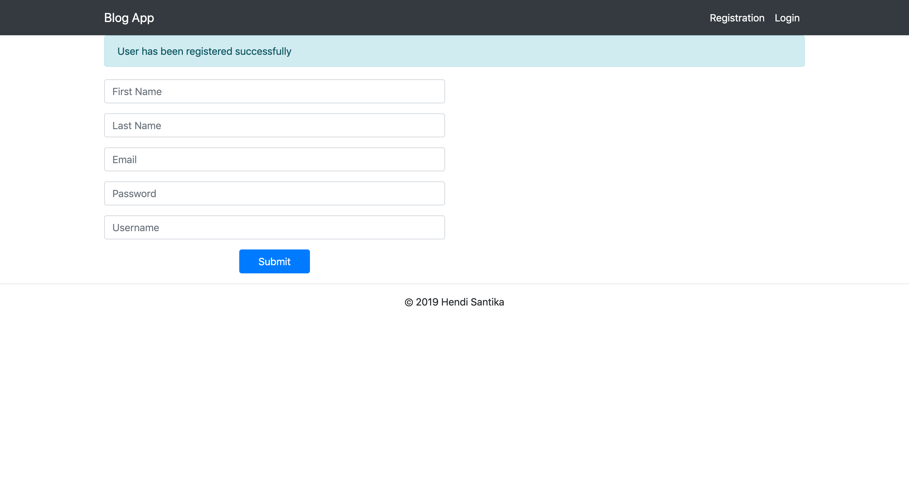

**Home Page**

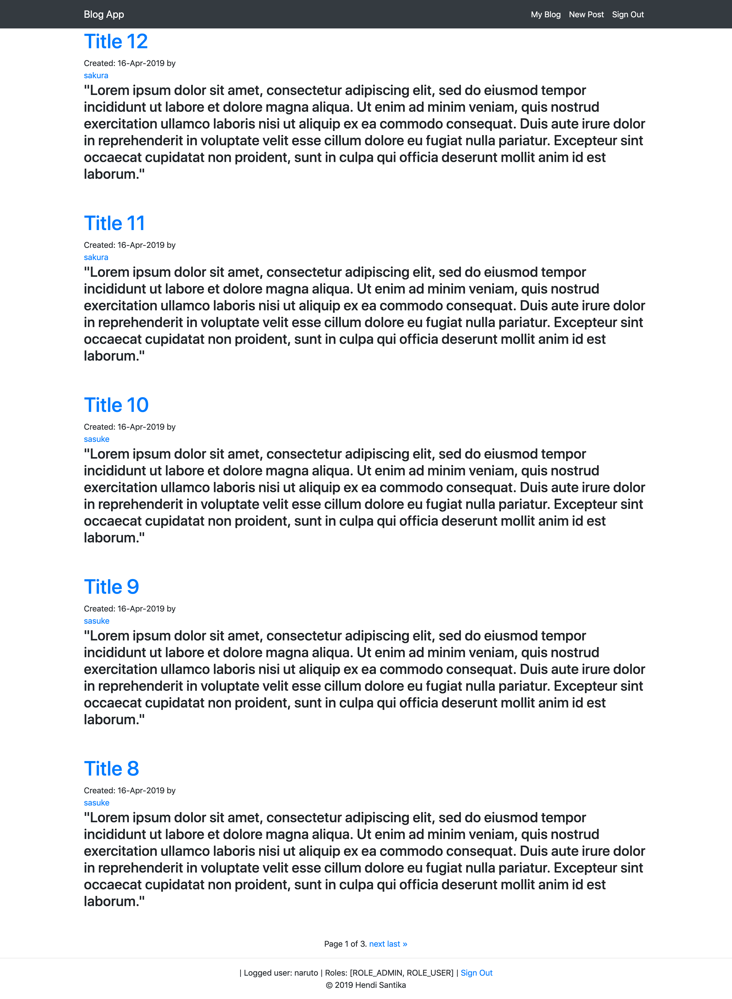

**Add New Post**

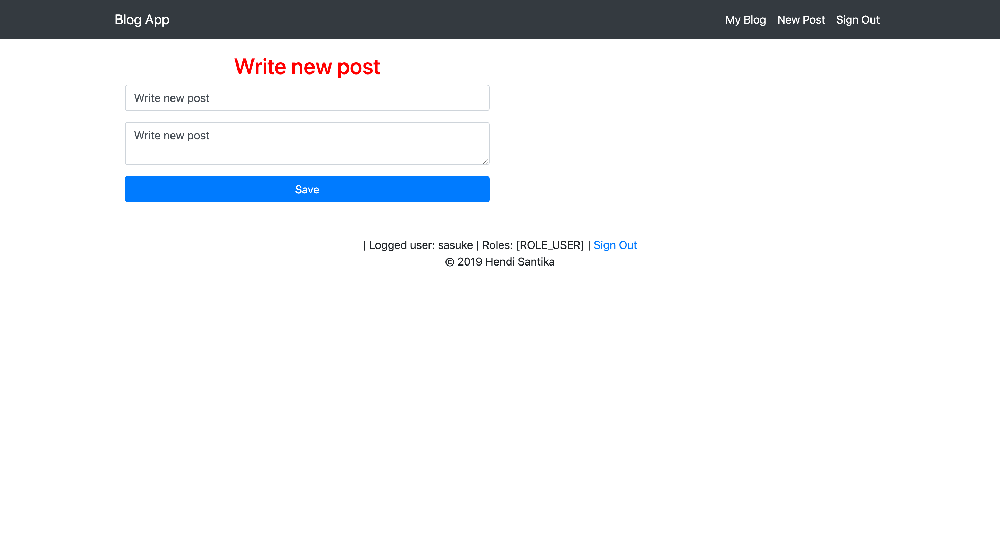

**User Blog Post**

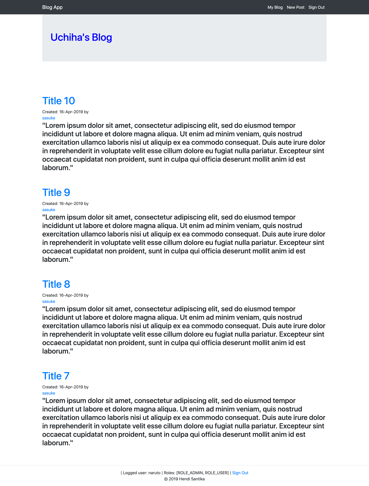

**Blog Post Details
**
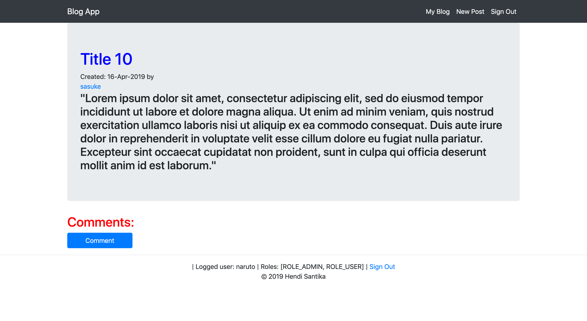

**User Comments**

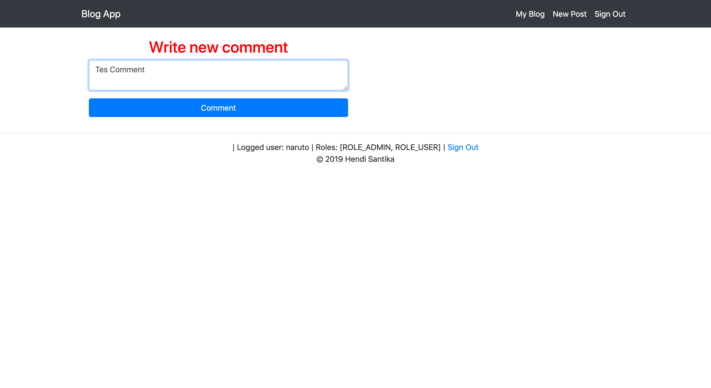

